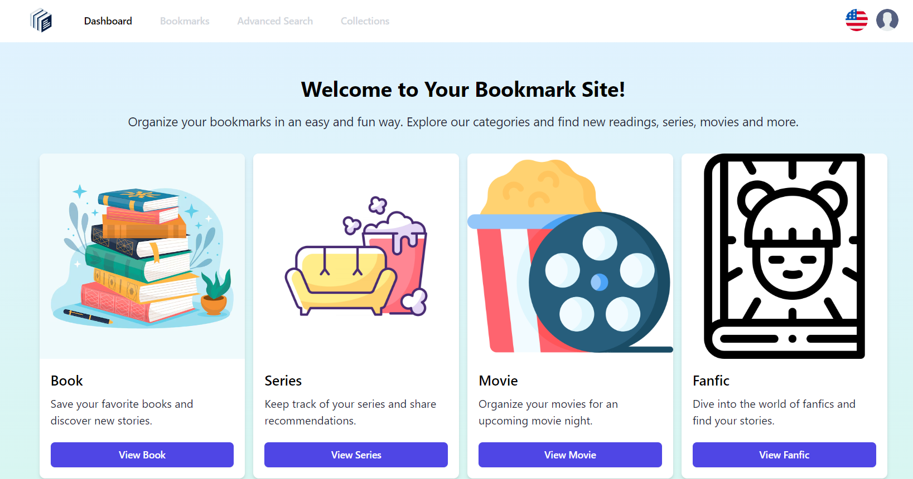
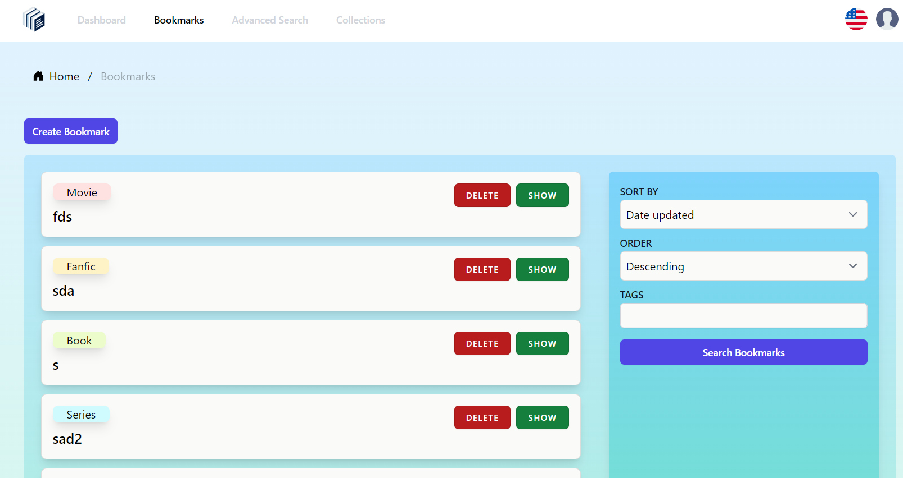
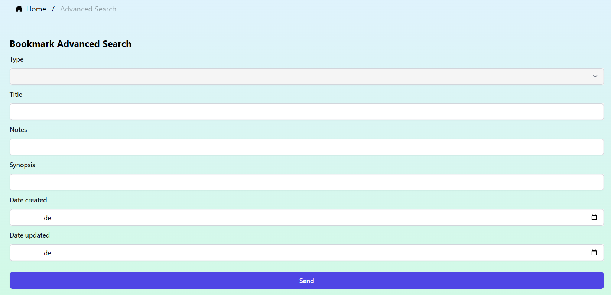
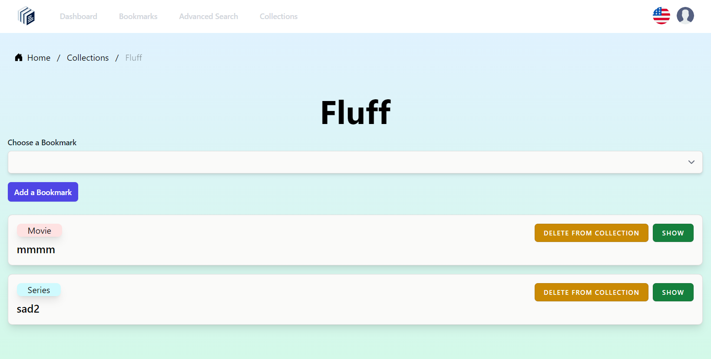

# MyBookmarks

- [MyBookmarks](#mybookmarks)
  - [Introducción](#introducción)
    - [Esquema de la base de datos](#esquema-de-la-base-de-datos)
  - [Cómo instalar en local](#cómo-instalar-en-local)
    - [Requisitos](#requisitos)
    - [Instalación](#instalación)
    - [Aplicación desplegada en remoto](#aplicación-desplegada-en-remoto)
  - [Cómo usar](#cómo-usar)
  - [Testing](#testing)

## Introducción

MyBookmarks es una aplicación para guardar y gestionar marcadores, permitiendo al usuario guardar su progreso actual mientras lee un libro o ve una serie o película. Todo lo que tiene que hacer es crear un marcador, seleccionar uno de los tipos de marcadores disponibles y introducir los datos requeridos. Si tiene demasiados marcadores, también tiene la opción de agruparlos en colecciones. Además, MyBookmarks también cuenta con un sistema de tags que permite al usuario clasificar y filtrar sus marcadores y colecciones a placer.

### Esquema de la base de datos


<!-- ### Como colaborar

1. Clonar el proyecto en tu equipo local.

2. Crear una nueva rama en la que se trabajará. El nombre de la rama debe describir el cambio que se está haciendo al proyecto. Por ejemplo: `añadir-frontend` o `solucionar-bug-en frontend`.

    Si el colaborador lo desea, también puede añadir al nombre de la rama el tipo de cambio que está haciendo en base a los [tipos de commits convencionales](https://theodorusclarence.com/shorts/conventional-commit-readme). Por ejemplo: `feat/añadir-frontend` o `fix/bug-en-frontend`.

3. Se harán commits cada vez que se termine de hacer un punto clave. Por ejemplo: si estás haciendo el frontend, hacer un commit cada vez que se termine de desarrollar una página, o al resolver un bug en una página ya creada.

   **¡IMPORTANTE!** Los commits se crearan siguiendo la convención especificada en está página: [Conventional Commits Readme](https://theodorusclarence.com/shorts/conventional-commit-readme). Los commits deberán incluir su tipo, el scope (qué carpetas o archivos han sido modificados/creados), y una descripción del commit. Los commits pueden ser en inglés o español, a preferencia del colaborador. Por ejemplo: `feat(resources): añadir frontend` o `fix(pagina.blade.php): bug en x página`. Para commits con una descripción más amplia:

   ```
   feat(resources): añadir frontend
   
   añadida página A
   añadida página B
   añadida página C
   ```

4. Una vez la tarea para la que se creo la rama sea terminada, se hará un `git pull` de la rama con la que se quiere fusionar (`main`) y se resolverá cualquier conflicto que pueda surgir. Se aconseja al colaborador que también ejecute todos los tests que puedan existir en el proyecto para asegurarse de que no haya roto nada por accidente.

5. Una vez los posible conflictos sean solucionados, se creará una Pull Request en GitHub (es necesario haber subido la rama y todos sus commits de antemano a GitHub) con nombre de la Pull Request, una breve descripción de los cambios realizados, y el propio colaborador asignará a un compañero del equipo como "asignee" para que revise su Pull Request.

   El asignee está en su derecho a solicitar al colaborador cualquier cambio que vea necesario después de revisar su Pull Request; en cuyo caso, el colaborador deberá realizar los cambios propuestos y avisar al asignee para que vuelva a revisar su Pull Request una vez realizados los cambios.

6. Una vez el asignee ha revisado la Pull Request y dado el visto bueno, el asignee fusionará la rama de la Pull Request con la rama `main`. La rama fusionada será borrada para evitar acumulación de ramas en el proyecto (si fuera necesario, la eliminación de la rama se puede revertir).

7. Si se encontrara algún bug en la rama `main` después de fusionarla con alguna rama, se creará un Issue en la sección "Issues" en el GitHub del proyecto explicando el problema y la posible causa. El colaborador causante del bug o cualquier otro es libre de asignarse así mismo el Issue y crear una rama `fix` para solucionar el bug. Se aconseja darle a "Watch" en el GitHub del proyecto para recibir una notificación cada vez que alguien comente o cree un Issue. -->

## Cómo instalar en local

### Requisitos

- Apache
- PHP
- Laravel
- PostgreSQL (o cualquier otra base de datos)
- Git
- Composer
- Node.js

### Instalación

1. Descargar el repositorio o clonarlo con el comando `git clone`.

2. Muevete dentro de la carpeta de la aplicacioón y ejecuta el comando `composer install` para instalar los paquetes vendor. Esto creará la carpeta `vendor` en el proyecto.

3. Si estás en Linux, posiblemente también tengas que ejecutar el comando `chmod -R 777 storage` o `chown www-data:www-data storage` dentro de la carpeta del repositorio para otorgar permisos a la carpeta `storage`.

4. Ejecutar el comando `npm install`. Esto creará la carpeta `node_modules` dentro de la carpeta de la aplicación.

5. Ejecuta el comando `npm run build` para compilar la aplicación y crear la carpeta `public/build`.

6. Abre el archivo `hosts` (en Windows lo puedes encontrar en la ruta `C:\Windows\System32\drivers\etc`) y editalo para añadir el host de la aplicación. El resultado final debería ser similar a esto:

    ```
    # MyBookmarks
    127.0.0.1       mybookmarks.local
    ```

    `mybookmarks.local` corresponde al link de la aplicación. Puedes poner la que quieras a placer.

7. Abre el archivo `httpd-vhosts.conf` (que se encuentra dentro de la carpeta de Apache en `conf/extra`) y editalo para añadir el virtual host de la aplicación:

    ```
    <VirtualHost mybookmarks.local:80>
        ServerName mybookmarks.local
        DocumentRoot "${SRVROOT}/htdocs/mybookmarks/public/"
        <Directory "${SRVROOT}/htdocs/mybookmarks/public/">
            DirectoryIndex index.php
            AllowOverride All
            Require all granted
        </Directory>
    </VirtualHost>
    ```

    **ATENCION:** Ten en cuenta que este ejemplo está hecho en un Apache instalado en Windows. La ruta a la carpeta de la aplicación (`${SRVROOT}/htdocs/mybookmarks/public/`) puede ser distinta dependiendo de tu sistema operativo, en cuyo caso tendrás que adaptarla en consecuencia para que funcione correctamente.

8. Reinicia Apache si lo tenías iniciado al momento de crear el virtual host. En caso contrario, inicialo.

9. Crea el archivo `.env` usando de base el `.env.example` y configura los parametros necesarios, como los de la base de datos y la APP_KEY.

10. Ejecuta el comando `php artisan migrate` para crear las tablas en tu base de datos.

11. Con Apache iniciado, abre el navegador y ve al link que indicaste al crear el host y el virtual host. En nuestro caso sería `mybookmarks.local`. Si todo salió bien, debería ser capaz de ver la página Home de la aplicación. ¡Ya puedes empezar a usarla!

### Aplicación desplegada en remoto

Actualmente, MyBookmarks se encuentra desplegada en remoto. Puedes acceder a ella a través de este link: [http://mybookmarks.randion.es/](http://mybookmarks.randion.es/).

## Cómo usar

1. Ingresa en la página de la aplicación, ya sea remota o localmente.

2. Registrate o inicia sesión. Puedes cambiar el idioma al inglés o español haciendo click en la imagen del idioma y seleccionando el que quieres entre los disponibles.

    

3. Una vez inicies sesión exitosamente, la página te llevará al Dashboard (Inicio), donde podrás ver una breve introducción a la página y las FAQs.

    

4. En Bookmarks (Marcadores), podrás visualizar los marcadores actualmente creados, así como ordenarlos o filtrarlos por tags. También podrás acceder desde acá a la página para crear o editar marcadores, así como a la posibilidad de eliminarlos. Los marcadores están ordenados por defecto en orden descendente por la fecha de actualización; cada vez que edites un marcador, se mostrará como el primero en la lista.

    

5. Si le das al botón `Create Bookmark` (`Crear Marcador`), podrás crear un marcador de entre los 4 tipos disponibles (Libro, Fanfic, Serie, Película) al rellenar los campos.

    

6. En Advanced Search (Búsqueda avanzada), puedes realizar un filtrado más extenso de los marcadores por tipo, titulo, sinopsis, notas, y fecha de creacion y actualizacion. Los marcadores resultantes de la búsqueda se mostrarán abajo.

    

7. En Collections (Colecciones), puedes ver, crear y acceder a colecciones en las que puedes agrupar tus marcadores para tenerlos bien organizados. Similar a los marcadores, puedes ordenar las colecciones a través de los opciones disponibles en el menú de la derecha, así como filtrar por tags.

    

8. Para añadir marcadores a una coleccion, dale al botón de `Show` (`Mostrar`), selecciona uno de tus marcadores y dale al botón para añadirlo. A través de está página también puedes ver los marcadores pertenecientes a esa colección, acceder a ellos para editarlos, o directamente borrarlos de la colección.

    

## Testing

Para ejecutar los tests, basta con meterse dentro de la carpeta de la aplicación y ejecutar el siguiente comando:   

```
php artisan test
```


Actualmente hay 110 tests, con 582 aserciones en total, evaluando la ejecución correcta de los controladores, la autenticación, y la estructura JSON:API de la aplicación.   
